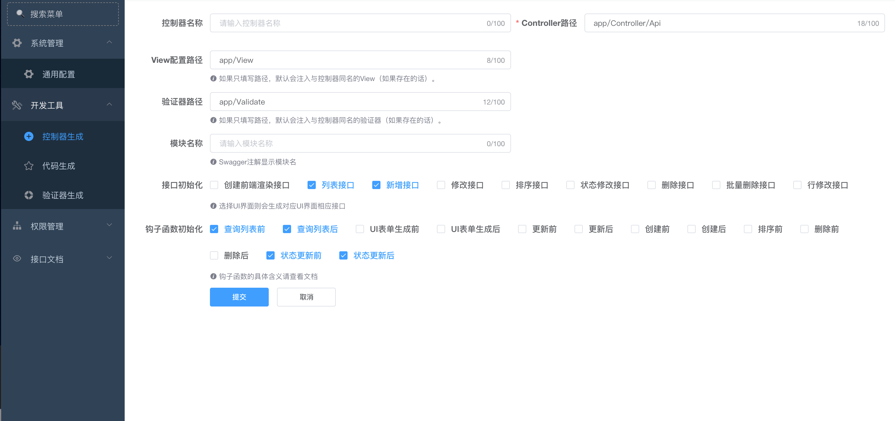
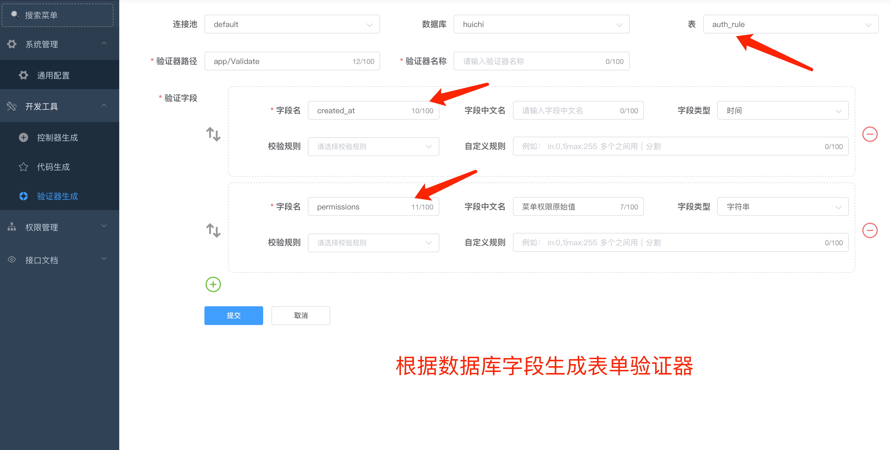
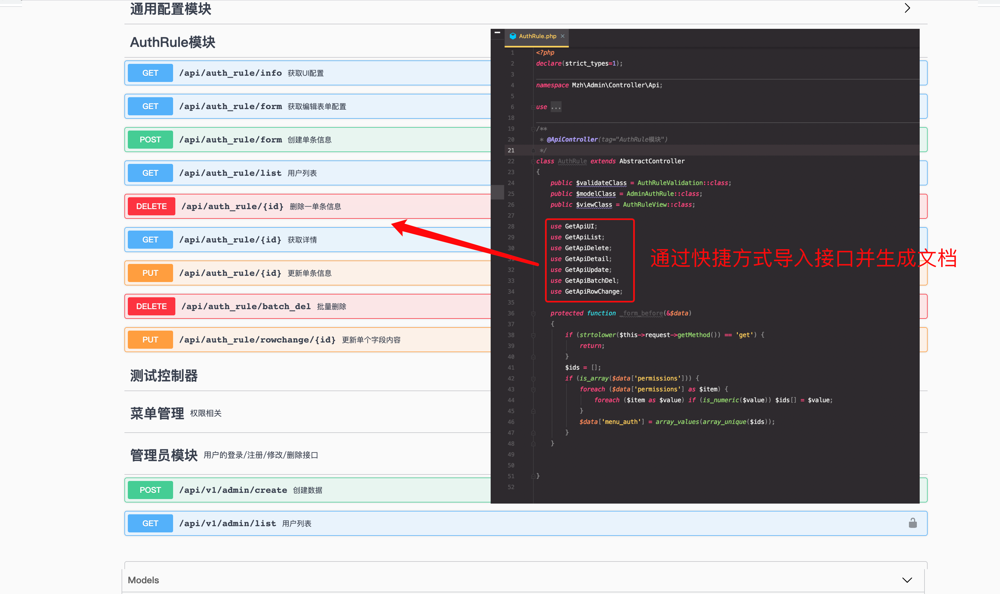
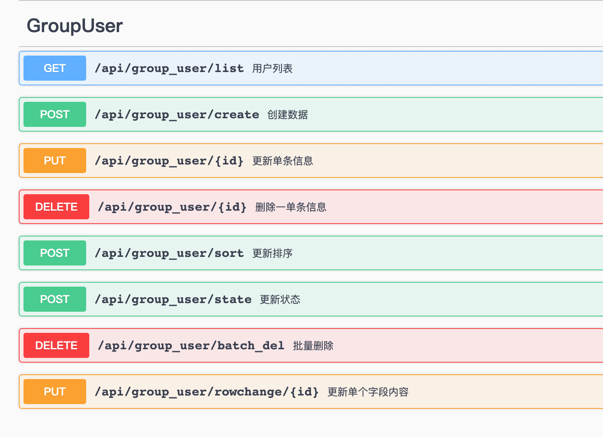

#### 开发中..
#### 以插件形式开箱即用
#### 可以做到无需VUE前端可实现快速开发各种表单
#### 后台可视化生成控制器、模型、验证器、View代码等
#### 后台表单、列表生成

#### 安装 (开发中，暂时不要使用)
```
 composer require mzh/hyperf-admin-plugin
```

#### 开发计划
- [x] 模型、控制器、验证器、UI界面生成  
- [x] 接口协议标准化处理
- [x] 系统配置
- [x] Swagger注解生成  
- [x] 脚手架工具  
- [x] 菜单管理  
- [x] 角色管理
- [ ] 用户管理
- [ ] 权限管理
- [ ] 任务中心
- [ ] 微信开放平台对接、小程序、公众号管理
- [ ] 微信公众号、小程序对接
- [ ] 多租户模式
- [ ] ...

#### 本项目在 https://hyperf-admin.github.io/hyperf-admin/#/ 基础上优化、并简化处理，搭配验证器，swagger文档，让您开发后台更加迅速、开箱即用






#### 脚手架工具 在控制器只需引用一下代码即可生成对应接口并注册路由、生成Swagger文档。简单易用，无需过多步骤。
    以下操作也可以在控制面板可视化生成
    
    - 全功能接口
    - 如需要以下全部功能 只需引用  use GetApiAction;
    
    - 自定义选择单项接口
    -前端UI接口       只需 use GetApiUi;
    -列表            只需 use GetApiList; （钩子中支持增加搜索条件、参数见下文钩子）
    -创建            只需 use GetApiCreate; （支持验证提交内容、创建前数据检测、参数见下文钩子）
    -删除            只需 use GetApiDelete; 
    -批量删除         只需 use GetApiDelete; 
    -更新            只需 use GetApiUpdate; 
    -排序            只需 use GetApiSort; 
    -启用禁用         只需 use GetApiState; 
    -单字段内容修改    只需 use GetApiRowChange; 
    
#### 钩子
   - _ +  method 方法 + _before 操作前 主要针对 入参验证、数据重构、字段修改等
   - _ +  method 方法 + _after 操作后 主要针对操作后数据返回客户端前的修改，例如数据重构、隐藏字段、删除敏感信息等
    
    0: _list_before       查询列表前
    1: _list_after       查询列表后       
    2: meddleFormRule       UI表单生成前       
    3: beforeFormResponse       UI表单生成后       
    4: _update_before       更新前       
    5: _update_after       更新后       
    6: _create_before       创建前       
    7: _create_after       创建后       
    8: _sort_before       排序前       
    9: _delete_before       删除前       
    10: _delete_after       删除后       
    11: _state_before       状态更新前       
    12: _state_after       状态更新后       


#### 例子 
```php
<?php 
declare(strict_types = 1);
namespace App\Controller\Api;

use Mzh\Admin\Controller\AbstractController;
use Mzh\Admin\Traits\GetApiBatchDel;
use Mzh\Admin\Traits\GetApiCreate;
use Mzh\Admin\Traits\GetApiDelete;
use Mzh\Admin\Traits\GetApiList;
use Mzh\Admin\Traits\GetApiRowChange;
use Mzh\Admin\Traits\GetApiSort;
use Mzh\Admin\Traits\GetApiState;
use Mzh\Admin\Traits\GetApiUpdate;
use Mzh\Swagger\Annotation\ApiController;
use Mzh\Swagger\Annotation\Body;
use Mzh\Swagger\Annotation\DeleteApi;
use Mzh\Swagger\Annotation\GetApi;
use Mzh\Swagger\Annotation\PostApi;
use Mzh\Swagger\Annotation\PutApi;
use Mzh\Swagger\Annotation\Query;

/**
 * @ApiController(tag="GroupUser")
 */
class GroupUser
{
    use GetApiList;
    use GetApiCreate;
    use GetApiUpdate;
    use GetApiSort;
    use GetApiState;
    use GetApiDelete;
    use GetApiBatchDel;
    use GetApiRowChange;
    use GetApiList;
    use GetApiUpdate;
    use GetApiCreate;
    use GetApiSort;
    use GetApiDelete;
    use GetApiBatchDel;

    /**
     * 列表查询前操作，这里可用于筛选条件添加、也可在此做权数据权限二次验证等
     */
    public function _list_before(\Mzh\Helper\DbHelper\QueryHelper &$query)
    {
        $query->addData('pid', 0); #追加搜索条件数据
        #以上条件实际输出为  $db->where('pid',0)

        $query->equal('module#tab_id,pid');  #设置查询条件 module、pid以完全匹配   tab_id为接收参数别名
        #以上条件实际输出为  $db->where('module',$data['tab_id'])->where('pid',$data['pid'])


        $query->like('name'); # 设置模糊查询条件  name
        #以上条件实际输出为  $db->whereLike('name','%'.$data['name'].'%')

        $query->timeBetween('create_time'); # 设置时间范围查询
        #以上条件实际输出为  $db->whereBetween('create_time', [$begin, $after])

        $query->in('id,user_id');           #如果请求参数中有 id，user_id 则自动设置条件
        #以上条件实际输出为  $db->whereIn('id',$data['id'])->whereIn('user_id',$data['id'])
        
        #通过以上操作，可轻松在钩子内实现筛选条件处理，
    }

    /**
     * 列表查询后操作，这里可用于列表数据二次编辑
     */
    public function _list_after(&$list)
    {
    }

    /**
     * 更新前操作，这里可以处理提交的参数
     * 这里的参数是已经经过验证器验证的
     * 也可在此做权数据权限二次验证等
     */
    public function _update_before(&$data)
    {
    }

    /**
     * 创建前操作，这里可以处理提交的参数
     * 这里的参数是已经经过验证器验证的
     * 也可在此做权数据权限二次验证等
     */
    public function _create_before(&$data)
    {
    }

    /**
     * 创建后操作，这里可以修改返回的值、例如隐藏字段等操作
     */
    public function _create_after(&$data)
    {
    }

    /**
     * 排序前操作
     * 也可在此做权数据权限二次验证等
     */
    public function _sort_before(&$data)
    {
    }

    /**
     * 删除前操作
     * 也可在此做权数据权限二次验证等
     */
    public function _delete_before($id, &$data)
    {
    }

    /**
     * 删除后操作，这里可以修改返回的值
     */
    public function _delete_after(&$data)
    {
    }

    /**
     * 排序前操作
     * 也可在此做权数据权限二次验证等
     */
    public function _state_before(&$data)
    {
    }

    /**
     * 状态修改后操作，例如删除缓存等
     */
    public function _state_after(&$data)
    {
    }
}
```

##### 通过以上代码，可以生成如下接口



