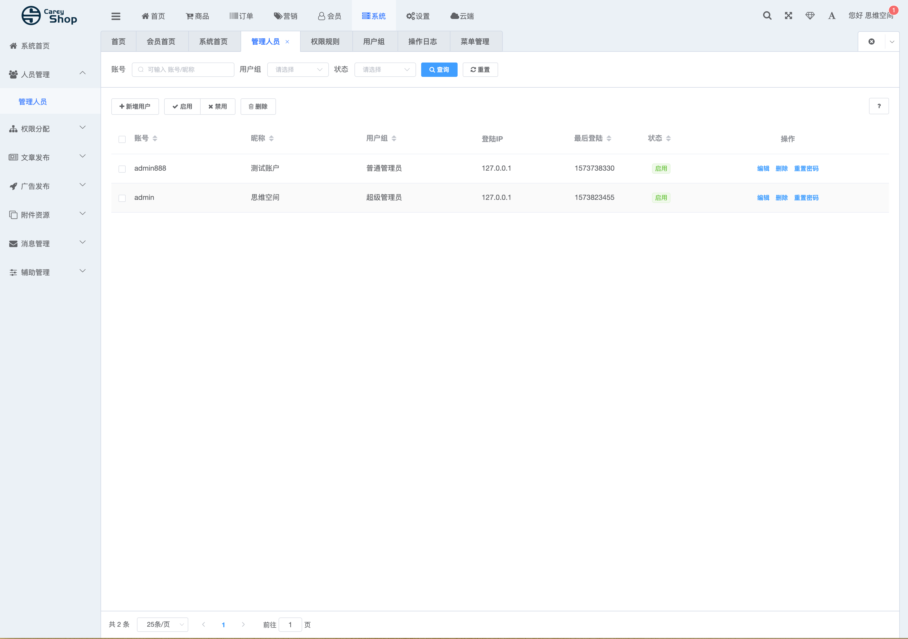
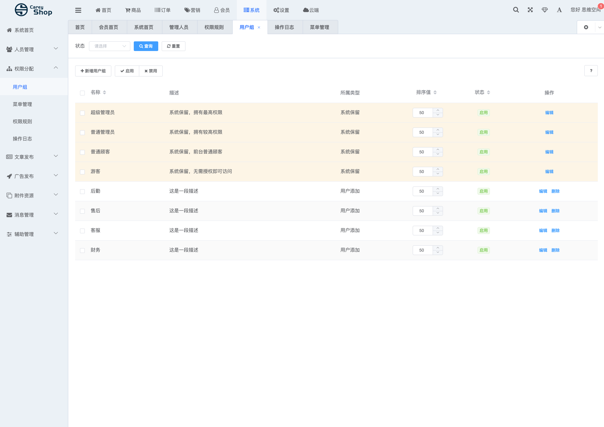
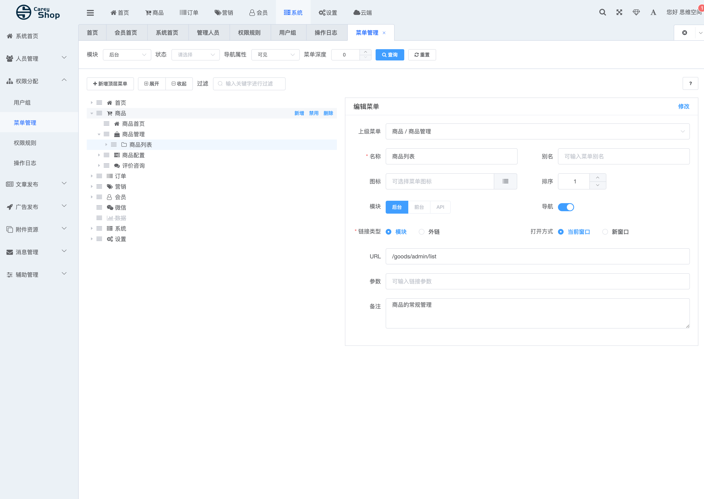
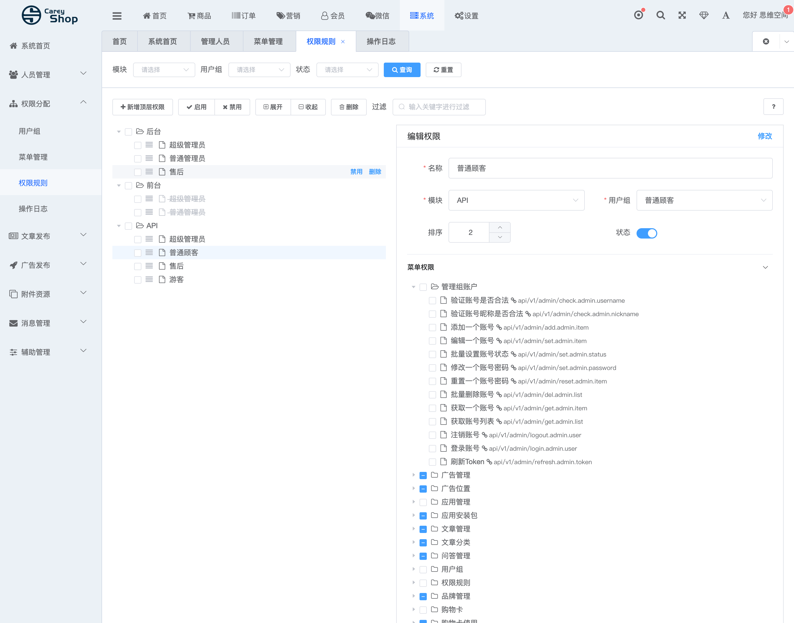
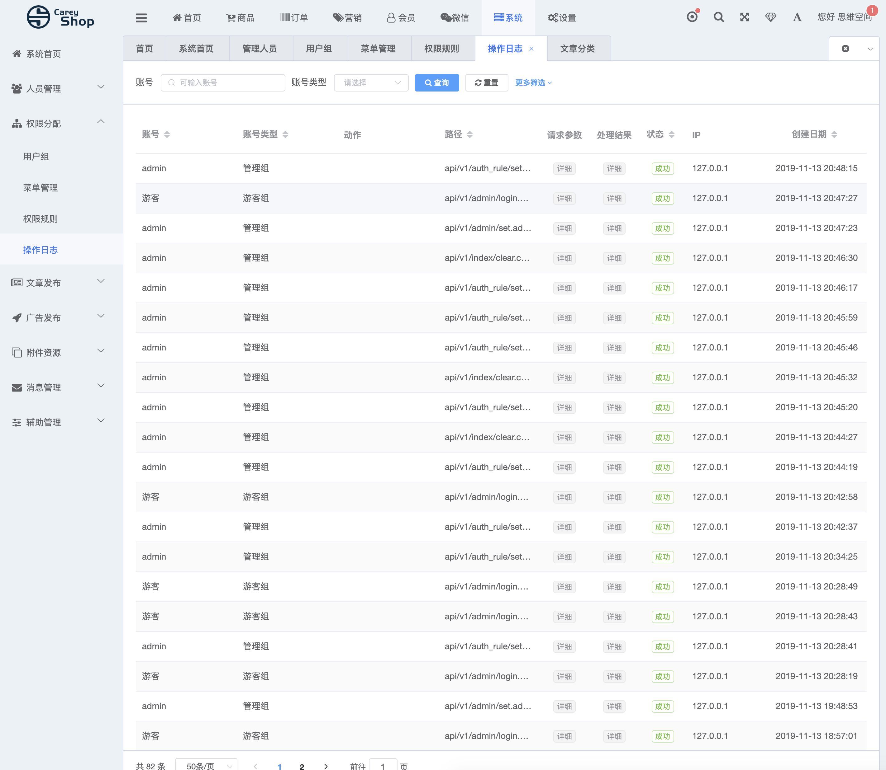

##本项目移植careyshop后台管理系统 前端基于d2admin，后端基于thinkphp5开发，从thinkphp移植到hyperf  
thinkphp版本文档地址 https://www.careyshop.cn/
#### 目前已完成
##### 1 管理员管理（全部功能）

### 2 权限分配
####     1、权限组管理

####    2、菜单管理

###     3、规则管理

###     4、操作日志

###     5、Token验证
#### Token 验证功能 可节点控制、可以菜单显示隐藏控制

更新表

    ALTER TABLE `new_admin`.`cs_menu` 
    ADD COLUMN `is_delete` tinyint(1) NOT NULL DEFAULT 0 COMMENT '0=为删除 1=已删除' ;
    
    ALTER TABLE `new_admin`.`cs_menu` 
    ADD COLUMN `update_time` int(11) NOT NULL DEFAULT 0 COMMENT '更新时间' ;
    
    ALTER TABLE `new_admin`.`cs_menu` 
    ADD COLUMN `create_time` int(11) NOT NULL DEFAULT 0 COMMENT '创建时间' ;
    
    ALTER TABLE `new_admin`.`cs_auth_rule` 
    ADD COLUMN `update_time` int(11) NOT NULL DEFAULT 0 COMMENT '创建时间' ;
    
    ALTER TABLE `new_admin`.`cs_auth_rule` 
    ADD COLUMN `create_time` int(11) NOT NULL DEFAULT 0 COMMENT '创建时间' ;

    ALTER TABLE `new_admin`.`cs_action_log` 
    ADD COLUMN `is_delete` tinyint(1) NOT NULL DEFAULT 0 COMMENT '0=为删除 1=已删除' ;
        
    ALTER TABLE `new_admin`.`cs_auth_group` 
    ADD COLUMN `create_time` int(11) NOT NULL DEFAULT 0 COMMENT '创建时间' ;

