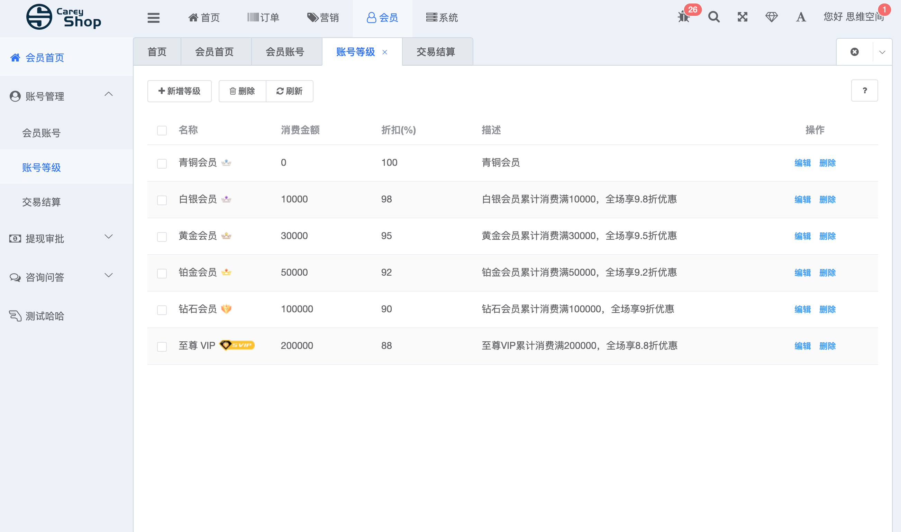
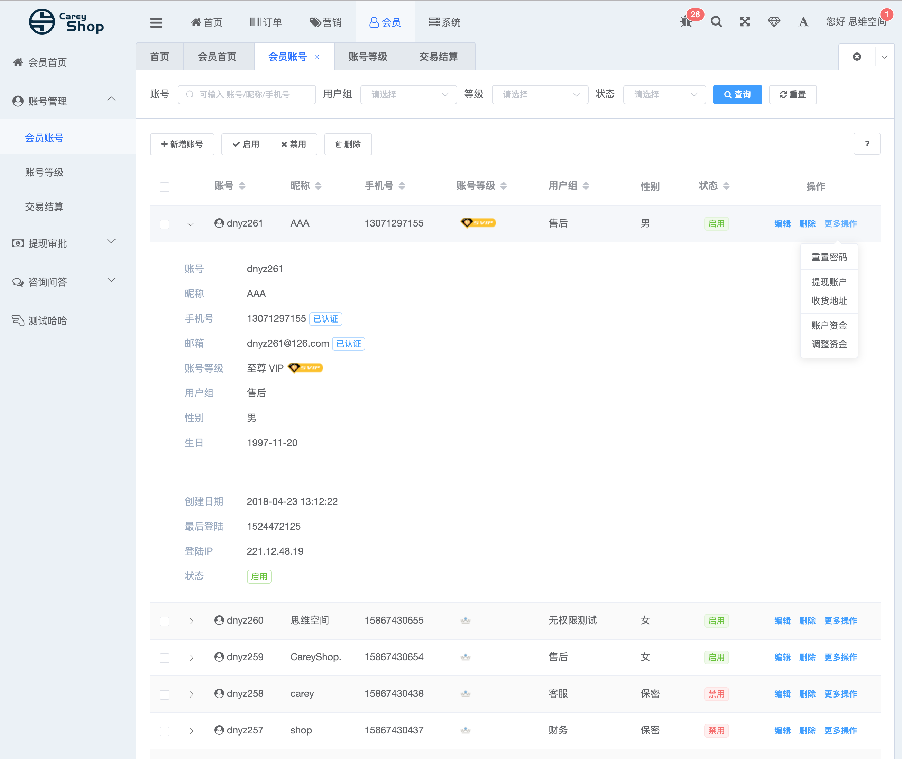
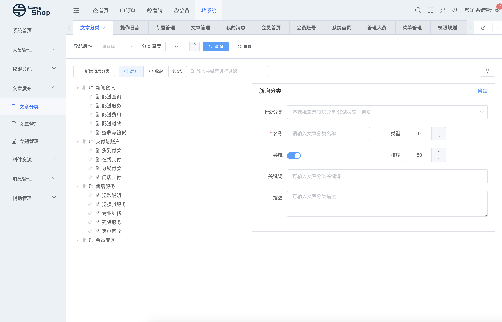

##本项目移植careyshop后台管理系统 前端基于d2admin，后端基于thinkphp5开发，从thinkphp移植到hyperf  
thinkphp 版本文档地址 https://www.careyshop.cn/

## 本项目在php74下开发 因为PHP74增加了新语法和支持定义变量类型，用起来比较方便，所以不打算兼容版本，只把定义的类型给去掉了，如果低版本使用，请自行修改XXXSevice 内的新语法 ??= 的部分

#### 目前已完成
##### 1 管理员管理 增删改查全部功能

### 2 权限分配
####     1、权限组管理  增删改查全部功能

####    2、菜单管理  增删改查全部功能

###     3、规则管理  增删改查全部功能

###     4、操作日志 

###     5、Token验证 基于jwt token 验证
#### Token 验证功能 可节点控制、可以菜单显示隐藏控制

###     6、账户等级 增删改查全部功能

###     7、会员账户 增删改查全部功能

 ###     8、文章管理 增删改查全部功能
 
  
## 版权信息
   
  CareyShop 仅提供个人非商业用途免费使用，商业需授权。
  
  本项目包含的第三方源码和二进制文件之版权信息另行标注。
  
  Copyright © 2016-2019 Carey Stu. 保留所有权利。