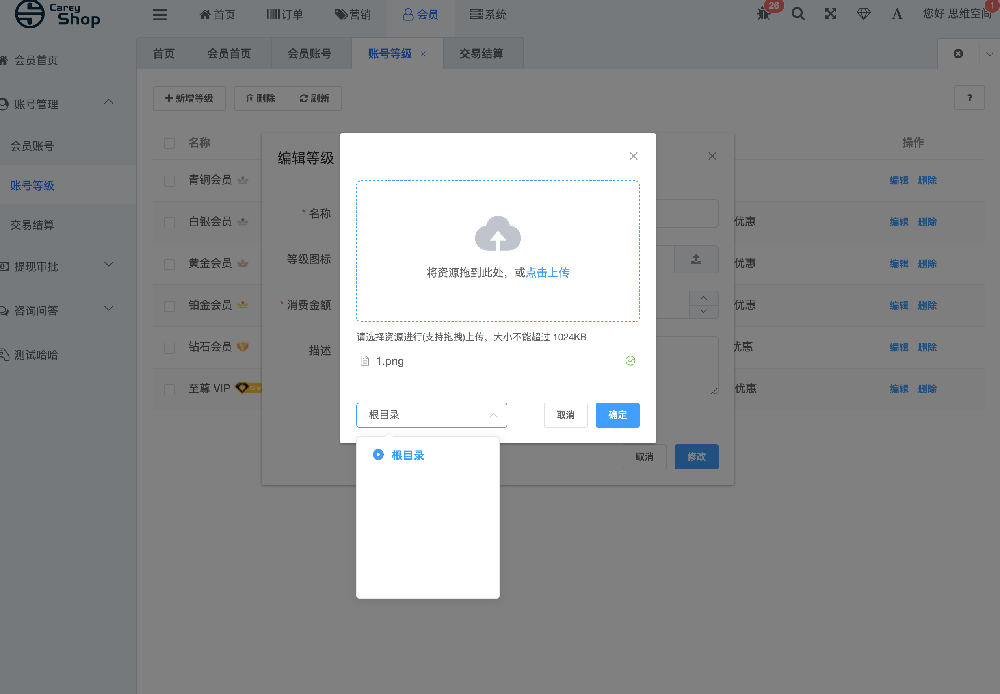

##本项目移植careyshop后台管理系统 前端基于d2admin，后端基于thinkphp5开发，从thinkphp移植到hyperf  
thinkphp版本文档地址 https://www.careyshop.cn/
#### 目前已完成
##### 1 管理员管理 增删改查全部功能

### 2 权限分配
####     1、权限组管理  增删改查全部功能

####    2、菜单管理  增删改查全部功能

###     3、规则管理  增删改查全部功能

###     4、操作日志 

###     5、Token验证
#### Token 验证功能 可节点控制、可以菜单显示隐藏控制

###     6、账户等级 增删改查全部功能

###     7、会员账户 增删改查全部功能

 ###     8、上传模块 上传模块目前只有本地储存驱动，可以自己增加阿里oss 七牛等等 按照接口约束即可增加
 
  
更新表

    2019.11.18更新sql start
        
    ALTER TABLE `new_admin`.`cs_user_level` 
    ADD COLUMN `create_time` int(11) NOT NULL DEFAULT 0 COMMENT '创建时间' ,
    ADD COLUMN `is_delete` tinyint(1) NOT NULL DEFAULT 0 COMMENT '0=为删除 1=已删除',
    ADD COLUMN `update_time` int(11) NOT NULL DEFAULT 0 COMMENT '创建时间' ;
    
    
      ALTER TABLE `new_admin`.`cs_storage` 
      ADD COLUMN `is_delete` tinyint(1) NOT NULL DEFAULT 0 COMMENT '0=为删除 1=已删除';
       
      ALTER TABLE `new_admin`.`cs_user_money` 
      ADD COLUMN `is_delete` tinyint(1) NOT NULL DEFAULT 0 COMMENT '0=为删除 1=已删除';
      
          ALTER TABLE `new_admin`.`cs_user_money` 
          ADD COLUMN `create_time` int(11) NOT NULL DEFAULT 0 COMMENT '创建时间' ,
          ADD COLUMN `update_time` int(11) NOT NULL DEFAULT 0 COMMENT '创建时间' ;
      
    end
    
    
    ALTER TABLE `new_admin`.`cs_menu` 
    ADD COLUMN `is_delete` tinyint(1) NOT NULL DEFAULT 0 COMMENT '0=为删除 1=已删除' ;
    
    ALTER TABLE `new_admin`.`cs_menu` 
    ADD COLUMN `update_time` int(11) NOT NULL DEFAULT 0 COMMENT '更新时间' ;
    
    ALTER TABLE `new_admin`.`cs_menu` 
    ADD COLUMN `create_time` int(11) NOT NULL DEFAULT 0 COMMENT '创建时间' ;
    
    ALTER TABLE `new_admin`.`cs_auth_rule` 
    ADD COLUMN `update_time` int(11) NOT NULL DEFAULT 0 COMMENT '创建时间' ;
    
    ALTER TABLE `new_admin`.`cs_auth_rule` 
    ADD COLUMN `create_time` int(11) NOT NULL DEFAULT 0 COMMENT '创建时间' ;

    ALTER TABLE `new_admin`.`cs_action_log` 
    ADD COLUMN `is_delete` tinyint(1) NOT NULL DEFAULT 0 COMMENT '0=为删除 1=已删除' ;
        
    ALTER TABLE `new_admin`.`cs_auth_group` 
    ADD COLUMN `create_time` int(11) NOT NULL DEFAULT 0 COMMENT '创建时间' ;

